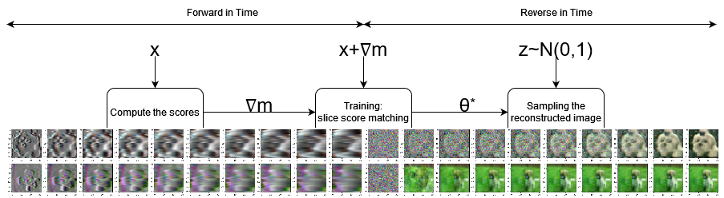

# Efficient Denoising using Score Embedding in Score-based Diffusion Models

by
Andrew S. Na,
William Gao,
and Justin W.L. Wan

This paper has been submitted for publication in [BMVC](https://bmvc2024.org/).

This repository is the official implementation of **Efficient Denoising using Score Embedding in Score-based Diffusion Models**.

The goal of this repo is to provide an implementation and demonstrate the efficiency of our denoising model. We solve the log-density FP equation and embed the resulting scores during training. The general idea is captured in the image below:

## Abstract

It is well known that training a denoising score-based diffusion model requires tens of thousands of epochs and a substantial number of image data to train the model. In this paper, we propose to increase the efficiency of training score-based diffusion models. Our method allows us to decrease the number of epochs needed to train the diffusion model. We accomplish this by solving the log-density Fokker-Planck (FP) Equation numerically to compute the score *before* training. The pre-computed score is embedded into the image to encourage faster training under slice Wasserstein distance. We demonstrate through our numerical experiments the improved performance of our proposed method compared to standard score-based diffusion models. Our proposed method achieves a similar quality to the standard method meaningfully faster.  

## Software implementation

All source code associated with our fast diffusion model is inside `fast_diffusion`. The reimplementation of DDIM and DDPM used for comparisons are inside `comparisons`.

For the DDIM and DDPM models, we copy the implementations from the original authors.

The GitHub repo for the original DDPM implementation can be found [here](https://github.com/yang-song/score_sde_pytorch) and DDIM [here](https://github.com/ermongroup/ddim).

There are also a few Jupyter Notebook `.ipynb` files scattered through the repository to serve as helpful utilities or guides.

We use data from CIFAR, CelebA, and ImageNet datasets. For CelebA and ImageNet datasets, we handpicked a few paper-appropriate images and stored them in `.pkl` files. Feel free to replace these `.pkl` files or modify `Dataset.py` to include other images from these datasets.

## Dependencies

You'll need a working Python environment to run the code.
The recommended way to set up your environment is through `pip`.

We also recommend using `pip` virtual environments to manage the project dependencies in
isolation.

To install the required packages:

    pip3 install -r requirements.txt

## Reproducing the results

All parameters for each run are stored in YAML configuration files. For our fast diffusion model, these can be found in `fast_diffusion/configs`, and for the comparison models, they can be found in `comparison/configs`. Each run will train a model, and save the trained model and a report to the `saves` folder. The report includes a summary of the relevant parameters used to train the model as well as a summary of the loss and a generated sample from the model.

### Running the fast diffusion model

First, make sure you have `cd` into the `fast_diffusion` directory. Then, to train the model, 
    
    python3 run.py --config <config_file_name>

To make a sample and regenerate a report on an already pre-trained model:

    python3 run.py --config <config_file_name> --no-train

For example:

    python3 run.py --config cifar1.yml

For a full list of options: `python3 run.py --help`

### Running DDPM or DDIM model for comparison

Running the comparison models is exactly the same as above except now everything takes place in the `comparison` directory.

First, make sure you have `cd` into the `comparison` directory. Then, to train the model, 
    
    python3 run.py --config <config_file_name>

To make a sample and regenerate a report on an already pre-trained model:

    python3 run.py --config <config_file_name> --no-train

For example:

    python3 run.py --config cifar1_ddpm.yml

For a full list of options: `python3 run.py --help`

### Profiling MSE and SSIM Losses

It is useful to track the SSIM and MSE values as the model trains. Adding the `--profile` flag will do this for any command described above. If enabled, the model will be sampled at regular intervals during training and the MSE and SSIM over time will appear in the `report.pdf` generated at the end of training. For example:

    python3 run.py --config cifar1.yml --profile

## License

All source code is made available under a BSD 3-clause license. You can freely
use and modify the code, without warranty, so long as you provide attribution
to the authors. See `LICENSE.md` for the full license text.

The manuscript text is not open source. The authors reserve the right to the
article content, which is currently submitted for publication in BMVC.
