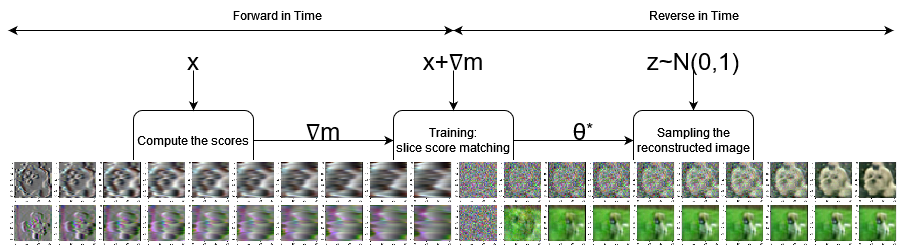

# Efficient Denoising using Score Embedding in Score-based Diffusion Models

by
Andrew S. Na,
William Gao,
and Justin W.L. Wan

This repository is the official implementation of **Efficient Denoising using Score Embedding in Score-based Diffusion Models** ([arXiv:2404.06661](https://arxiv.org/abs/2404.06661)).

This is a companion reproducibility artifact to *Efficient Score Pre-computation for Diffusion Models via Cross-Matrix Krylov Projection* ([arXiv:2511.17634](https://arxiv.org/abs/2511.17634)), submitted to the [RRPR 2026 Workshop](https://tc22-team.github.io/rrpr2026/).

The goal of this repo is to provide a fully reproducible implementation of score pre-computation via the log-density Fokker-Planck (FP) equation for diffusion model training. The general idea is captured in the image below:



## Abstract

In this paper, we propose a novel approach that increases the efficiency of training score-based diffusion models. It is well known that training a denoising score-based diffusion model requires tens of thousands of epochs and a substantial number of image data to train the model. To address the computational issue, our approach decreases the training time by solving the log-density Fokker-Planck (FP) equation numerically to compute the score *before* training. The pre-computed score is embedded into the image to yield faster training under slice Wasserstein distance. We demonstrate through our numerical experiments the improved performance of our proposed method compared to standard score-based diffusion models. The results show that our method achieves a speedup that ranges from around 5 to over 15 times compared to the standard methods for images from a variety of datasets.

## Software implementation

All source code associated with our fast diffusion model is inside `fast_diffusion`. The reimplementation of DDIM and DDPM used for comparisons are inside `comparisons`.

For the DDIM and DDPM models, we copy the implementations from the original authors.

The GitHub repo for the original DDPM implementation can be found [here](https://github.com/yang-song/score_sde_pytorch) and DDIM [here](https://github.com/ermongroup/ddim).

There are also a few Jupyter Notebook `.ipynb` files scattered through the repository to serve as helpful utilities or guides.

We use data from CIFAR, CelebA, and ImageNet datasets. For CelebA and ImageNet datasets, we handpicked a few paper-appropriate images and stored them in `.pkl` files. Feel free to replace these `.pkl` files or modify `Dataset.py` to include other images from these datasets.

## Dependencies

You'll need a working Python environment to run the code. We recommend using a virtual environment.

### Setup

```bash
python -m venv .venv

# Linux/macOS
source .venv/bin/activate

# Windows PowerShell
.venv\Scripts\Activate.ps1

pip install -r requirements.txt
```

## Reproducing the results

All parameters for each run are stored in YAML configuration files. For our fast diffusion model, these can be found in `fast_diffusion/configs`, and for the comparison models, they can be found in `comparisons/configs`. Each run will train a model, and save the trained model and a report to the `saves` folder. The report includes a summary of the relevant parameters used to train the model as well as a summary of the loss and a generated sample from the model.

### Quick start — reproduce all experiments

From the repository root, run:

```bash
python reproduce_all.py
```

This runs all main configs, ablation configs, and comparison baselines across 3 seeds (9, 42, 123) and writes a summary to `reproduction_summary.csv`.

Options:

```bash
python reproduce_all.py --main-only          # Only main configs
python reproduce_all.py --ablations-only     # Only ablation sweeps
python reproduce_all.py --comparisons-only   # Only DDPM/DDIM baselines
python reproduce_all.py --seeds 9 42 123 456 # Custom seeds
python reproduce_all.py --profile            # Track MSE/SSIM over time
python reproduce_all.py --dry-run            # Print commands without running
```

### Running the fast diffusion model

First, make sure you have `cd` into the `fast_diffusion` directory. Then, to train the model:

    python run.py --config <config_file_name>

To override the random seed (for multi-seed reproducibility runs):

    python run.py --config cifar1.yml --seed 42

To make a sample and regenerate a report on an already pre-trained model:

    python run.py --config <config_file_name> --no-train

For a full list of options: `python run.py --help`

### Running DDPM or DDIM model for comparison

Running the comparison models is exactly the same as above except now everything takes place in the `comparisons` directory.

    cd comparisons
    python run.py --config cifar1_ddpm.yml

### Profiling MSE and SSIM Losses

Adding the `--profile` flag will sample the model at regular intervals during training and include MSE and SSIM over time in the generated `report.pdf`:

    python run.py --config cifar1.yml --profile

### Ablation configs

Ablation configs for parameter sensitivity analysis are in `fast_diffusion/configs/ablations/`. These sweep over:

| Parameter | Values | Configs |
|---|---|---|
| Grid spacing (`dh`) | 0.5, 1 (baseline), 2, 4 | `cifar1_dh05.yml`, `cifar1_dh2.yml`, `cifar1_dh4.yml` |
| Timesteps (`N`) | 5, 10, 20 (baseline), 50 | `cifar1_N5.yml`, `cifar1_N10.yml`, `cifar1_N50.yml` |
| Solve tolerance | 1e-4, 1e-6, 2e-8 (baseline), 1e-10 | `cifar1_tol1e4.yml`, `cifar1_tol1e6.yml`, `cifar1_tol1e10.yml` |
| Sigma (`σ`) | 3, 5 (baseline), 10, 25 | `cifar1_sigma3.yml`, `cifar1_sigma10.yml`, `cifar1_sigma25.yml` |

### Outputs

Each run produces:

- `saves/<name>/model.pth` — trained model checkpoint
- `saves/<name>/scores.npy` — pre-computed FP scores
- `saves/<name>/timing.csv` — wall-clock breakdown (KDE init, FP solve, training)
- `saves/<name>/convergence_log.csv` — per-iteration FP residual history
- `saves/<name>/report.pdf` — summary with loss curves and generated samples

## License

All source code is made available under a BSD 3-clause license. You can freely
use and modify the code, without warranty, so long as you provide attribution
to the authors. See `LICENSE.md` for the full license text.
