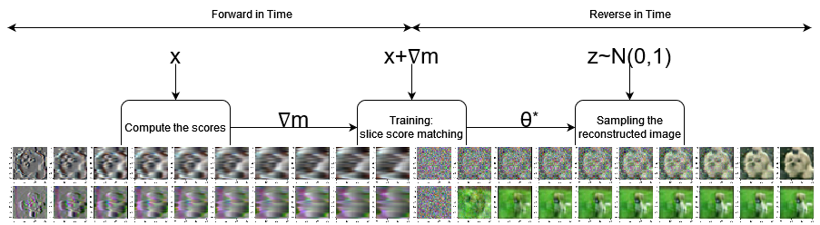

# Efficient Denoising using Score Embedding in Score-based Diffusion Models

by
Andrew S. Na,
William Gao,
and Justin W.L. Wan

This repository is the official implementation of **Efficient Denoising using Score Embedding in Score-based Diffusion Models** ([arXiv:2404.06661](https://arxiv.org/abs/2404.06661)).

This is a companion reproducibility artifact to *Efficient Score Pre-computation for Diffusion Models via Cross-Matrix Krylov Projection* ([arXiv:2511.17634](https://arxiv.org/abs/2511.17634)), submitted to the [RRPR 2026 Workshop](https://tc22-team.github.io/rrpr2026/).

The goal of this repo is to provide a fully reproducible implementation of score pre-computation via the log-density Fokker-Planck (FP) equation for diffusion model training. The general idea is captured in the image below:



## Abstract

In this paper, we propose a novel approach that increases the efficiency of training score-based diffusion models. It is well known that training a denoising score-based diffusion model requires tens of thousands of epochs and a substantial number of image data to train the model. To address the computational issue, our approach decreases the training time by solving the log-density Fokker-Planck (FP) equation numerically to compute the score *before* training. The pre-computed score is embedded into the image to yield faster training under slice Wasserstein distance. We demonstrate through our numerical experiments the improved performance of our proposed method compared to standard score-based diffusion models. The results show that our method achieves a speedup that ranges from around 5 to over 15 times compared to the standard methods for images from a variety of datasets.

## Software implementation

All source code associated with our fast diffusion model is inside `fast_diffusion`. The reimplementation of DDIM and DDPM used for comparisons are inside `comparisons`.

For the DDIM and DDPM models, we copy the implementations from the original authors.

The GitHub repo for the original DDPM implementation can be found [here](https://github.com/yang-song/score_sde_pytorch) and DDIM [here](https://github.com/ermongroup/ddim).

There are also a few Jupyter Notebook `.ipynb` files scattered through the repository to serve as helpful utilities or guides.

We use data from CIFAR, CelebA, and ImageNet datasets. For CelebA and ImageNet datasets, we handpicked a few paper-appropriate images and stored them in `.pkl` files. Feel free to replace these `.pkl` files or modify `Dataset.py` to include other images from these datasets.

### Pipeline

The pipeline has three stages:

1. **Density initialisation** (`fast_diffusion/model/density.py` -- `score_samples`)
   Per image and channel, pixel-value pairs are assembled into a `(2, N)` array and
   an initial log-density is estimated. Three estimators are selectable through the
   `diffusion.kde_method` config key:

   - `histogram` (default): bin into a 256x256 grid, smooth with
     `scipy.ndimage.gaussian_filter` (FFT internally), then interpolate back to the
     sample coordinates. O(N) binning plus O(M log M) convolution, M = 256^2.
   - `scipy`: exact `scipy.stats.gaussian_kde`, O(N^2). Accuracy reference.
   - `sklearn`: tree-accelerated `KernelDensity`.

   Because the histogram estimator's cost is dominated by its **fixed** 256^2 grid,
   it is roughly *constant in image resolution*, while exact KDE is O(N^2) in the
   pixel count. Measured (`python benchmark_density.py`, median of 3, warmed up):

   | resolution | N | histogram | scipy exact | speedup |
   |---|---|---|---|---|
   | 8x8 | 64 | 43.6 ms | 0.5 ms | 0.01x |
   | 16x16 | 256 | 35.1 ms | 1.1 ms | 0.03x |
   | 24x24 | 576 | 30.7 ms | 3.6 ms | 0.12x |
   | 32x32 | 1,024 | 27.6 ms | 10.1 ms | 0.37x |
   | 48x48 | 2,304 | 23.7 ms | 44.8 ms | **1.89x** |
   | 64x64 | 4,096 | 23.0 ms | 142.9 ms | **6.20x** |
   | 128x128 | 16,384 | 19.7 ms | intractable | -- |
   | 256x256 | 65,536 | 23.3 ms | intractable | -- |

   So the histogram estimator is **slower below about 48x48**, the crossover is at
   48x48, and its advantage then grows quadratically with the pixel count.

   > Correction: an earlier version of this README, and the docstring it came from,
   > claimed "~250x faster for 64x64 images". That figure was never measured. The
   > previously committed benchmark timed exact KDE only up to 32x32 and left the
   > 64x64 column empty. The measured 64x64 speedup is 6.2x. Quote
   > `benchmark_density.py` output, not the 250x figure.

2. **Fokker-Planck solve** (`fast_diffusion/model/kfp.py` — `compute_scores`)  
   For each image and diffusion timestep, the log-density Fokker-Planck (FP) equation is discretised using a finite-difference stencil assembled as a sparse CSR matrix (`construct_A`). The system is solved with `scipy.sparse.linalg.spsolve`. A fixed-point iteration runs until the relative residual norm falls below `solve_tolerance` (default 2×10⁻⁸). Convergence typically takes 7–11 iterations. The score (log-density gradient) is extracted by centred finite differences.

3. **Training with score embedding** (`fast_diffusion/model/train.py`, `fast_diffusion/model/dataloader.py`)  
   Pre-computed scores are embedded into perturbed training images via a reverse-ODE step before being passed to the network. The network is trained under the slice Wasserstein loss (`fast_diffusion/model/loss.py`).

### Reproducibility instrumentation

Every run writes:

| File | Contents |
|---|---|
| `timing.csv` | Wall-clock per stage: KDE init, FP solve (+ iteration count), training, total |
| `convergence_log.csv` | Residual norm per fixed-point iteration per image, with wall-clock timestamps |
| `scores.npy` | Pre-computed score field (shape: `[N_images, N_timesteps, C, H, W]`) |

Seeds are fully controlled: `data_loader.seed` in each YAML sets `np.random.seed`, `torch.manual_seed`, and `torch.cuda.manual_seed_all` at the start of every run. Use `--seed <N>` on the CLI to override.

## Dependencies

You'll need a working Python environment to run the code. We recommend using a virtual environment.

### Setup

```bash
python -m venv .venv

# Linux/macOS
source .venv/bin/activate

# Windows PowerShell
.venv\Scripts\Activate.ps1

pip install -r requirements.txt
```

## Reproducing the results

All parameters for each run are stored in YAML configuration files. For our fast diffusion model, these can be found in `fast_diffusion/configs`, and for the comparison models, they can be found in `comparisons/configs`. Each run will train a model, and save the trained model and a report to the `saves` folder. The report includes a summary of the relevant parameters used to train the model as well as a summary of the loss and a generated sample from the model.

### Quick start — reproduce all experiments

From the repository root, run:

```bash
python reproduce_all.py
```

This runs all main configs, ablation configs, and comparison baselines across 3 seeds (9, 42, 123) and writes a summary to `reproduction_summary.csv`.

Options:

```bash
python reproduce_all.py --main-only          # Only main configs
python reproduce_all.py --ablations-only     # Only ablation sweeps
python reproduce_all.py --comparisons-only   # Only DDPM/DDIM baselines
python reproduce_all.py --seeds 9 42 123 456 # Custom seeds
python reproduce_all.py --profile            # Track MSE/SSIM over time
python reproduce_all.py --dry-run            # Print commands without running
```

### Running the fast diffusion model

First, make sure you have `cd` into the `fast_diffusion` directory. Then, to train the model:

    python run.py --config <config_file_name>

To override the random seed (for multi-seed reproducibility runs):

    python run.py --config cifar1.yml --seed 42

To make a sample and regenerate a report on an already pre-trained model:

    python run.py --config <config_file_name> --no-train

For a full list of options: `python run.py --help`

### Running DDPM or DDIM model for comparison

Running the comparison models is exactly the same as above except now everything takes place in the `comparisons` directory.

    cd comparisons
    python run.py --config cifar1_ddpm.yml

### Profiling MSE and SSIM Losses

Adding the `--profile` flag will sample the model at regular intervals during training and include MSE and SSIM over time in the generated `report.pdf`:

    python run.py --config cifar1.yml --profile

### Ablation configs

Ablation configs for parameter sensitivity analysis are in `fast_diffusion/configs/ablations/`. These sweep over:

| Parameter | Values | Configs |
|---|---|---|
| Grid spacing (`dh`) | 0.5, 1 (baseline), 2, 4 | `cifar1_dh05.yml`, `cifar1_dh2.yml`, `cifar1_dh4.yml` |
| Timesteps (`N`) | 5, 10, 20 (baseline), 50 | `cifar1_N5.yml`, `cifar1_N10.yml`, `cifar1_N50.yml` |
| Solve tolerance | 1e-4, 1e-6, 2e-8 (baseline), 1e-10 | `cifar1_tol1e4.yml`, `cifar1_tol1e6.yml`, `cifar1_tol1e10.yml` |
| Sigma (`σ`) | 3, 5 (baseline), 10, 25 | `cifar1_sigma3.yml`, `cifar1_sigma10.yml`, `cifar1_sigma25.yml` |

### Outputs

Each run produces:

- `saves/<name>/model.pth` — trained model checkpoint
- `saves/<name>/scores.npy` — pre-computed FP scores
- `saves/<name>/timing.csv` — wall-clock breakdown (KDE init, FP solve, training)
- `saves/<name>/convergence_log.csv` — per-iteration FP residual history
- `saves/<name>/report.pdf` — summary with loss curves and generated samples

## Video extension (2D dynamic video)

An extension of the same score-precomputation idea from single images to **2D dynamic
video** is under development for an invited Eurographics full paper. See `PLAN.md` for
the plan and the measured results.

**Scope.** The domain is `T x H x W`: two spatial dimensions plus time. Dynamic 3D and
4D representations (deformable Gaussians, dynamic NeRF) are explicitly *out* of scope.
Where the code says "3D" it means the number of axes in the linear system or the use
of `Conv3d`, never volumetric data — the FP grid is (time, value, value), and two of
those axes are pixel-*value* axes rather than spatial ones.

The regime is unchanged from the image path: this is **per-instance score
precomputation and fitting**, not learning a data distribution. Scores are solved per
clip and the network is indexed by a clip identity embedding. Reported quality is
against the fitted clips, and speedups are in fitting wall-clock, not sampling.

### What is measured

| result | measurement | script |
|---|---|---|
| Unconditional stability from upwinding | dominance margin exactly 1.0 for every `sigma`, `N`, `\|s\|` tested | `validate_all.py` |
| Spatial order, upwind vs central | 0.99 vs 2.04 | `benchmark_stencil.py` |
| Artificial diffusion from upwinding | `\|s\|h/2` relative to physical, confirmed to 4 digits; ~50% at the shipped `dh=1` | `benchmark_stencil.py` |
| Central-difference limits | M-matrix to `\|s\|h<=2`, converges to ~2.6, diverges by 3.0 | `benchmark_stencil.py` |
| KL keyframe trigger: cost | 7.54x cheaper per frame than full re-estimation | `benchmark_keyframe_trigger.py` |
| KL keyframe trigger: discrimination | 2591x vs the worst within-shot frame; 0 false positives in 23 control frames | `benchmark_keyframe_trigger.py` |
| GPU solver speedup (end to end) | 0.36x at 8x32x32, 1.36x at 16x64x64, 5.36x at 16x128x128 | `benchmark_solver.py` |

Two things deliberately reported as negatives rather than omitted: the cross-clip
score warm start measured only 1.12x and was **removed**, and the temporal path does
not yet beat a per-frame baseline at short training budgets (-0.09 dB masked PSNR at
60 epochs, with a trivial `copy_prev` baseline ahead of both). `run_video.py` prints a
warning whenever the latter holds. See `PLAN.md` §8.3b and §8.3.

### Getting the evaluation assets

FVD is only comparable with published numbers when computed on the canonical
Kinetics-400 I3D features, and those weights are not redistributable with this repo.
`fvd()` therefore **raises** if they are absent rather than substituting another
backbone — a non-comparable FVD is a different quantity with the same name, not a
weaker result.

```bash
python download_assets.py              # I3D weights + DAVIS 2017 480p (~1.6 GB)
python download_assets.py --only i3d   # weights alone (~51 MB)
```

Both are checksummed and functionally verified on download (the I3D check asserts a
400-d feature width). `assets/` is gitignored.

### Running the video pipeline

```bash
# Synthetic clips: exact known flow and a controllable scene cut, no download needed.
python run_video.py --config synth_inpaint.yml

# DAVIS 2017 with real per-object masks. This is the headline comparison.
python run_video.py --config davis_inpaint.yml
```

Inpainting quality is reported **inside the mask**, with mask coverage alongside it. A
whole-frame PSNR on a masked task is inflated by roughly `-10*log10(coverage)` — about
9 dB at DAVIS's mean 12% coverage — because most of the frame was never modified.

## License

All source code is made available under a BSD 3-clause license. You can freely
use and modify the code, without warranty, so long as you provide attribution
to the authors. See `LICENSE.md` for the full license text.
